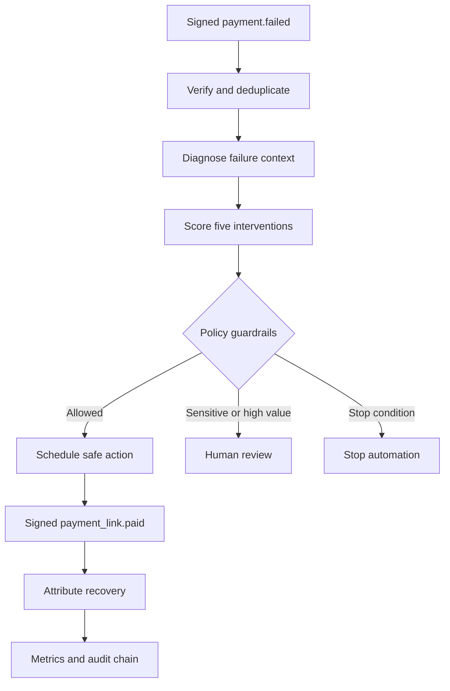

# Architecture and Recovery Flow

## Component responsibilities

| Component | Responsibility |
|---|---|
| `app/webhooks.py` | Exact-body HMAC verification, event parsing, failure taxonomy and webhook-to-case mapping. |
| `ml/features.py` | Defines the feature contract shared by training and inference. |
| `models/action_model.joblib` | Calibrated recovery-probability estimator for all candidate actions. |
| `app/decision_engine.py` | Expected-net-value selection plus deterministic stopping, timing and escalation rules. |
| `app/database.py` | Idempotent cases, candidate scores, workflow state, recovery attribution and persistent audit events. |
| `app/executor.py` | Safe simulated executor; never contacts customers or Razorpay. |
| `app/main.py` | FastAPI endpoints, dashboard delivery and workflow orchestration. |
| `static/` | Judge-facing operations dashboard and one-click demonstration. |

## Core decision

For each allowed action:

`expected net value = predicted recovery probability × amount at risk − action cost − fatigue penalty`

The model proposes five probabilities. Policy rules then remove unsafe actions, override sensitive cases, delay contact during quiet hours, or stop the workflow. This separation keeps prediction flexible and safety deterministic.

## Trust boundaries

1. Webhook authenticity is checked before JSON processing.
2. Delivery IDs and payload hashes prevent duplicate or conflicting replays.
3. Terminal workflow states cannot be reopened through invalid transitions.
4. Outcome attribution requires the exact execution reference and full amount.
5. The audit verifier detects modification or reordering of stored workflow events.
